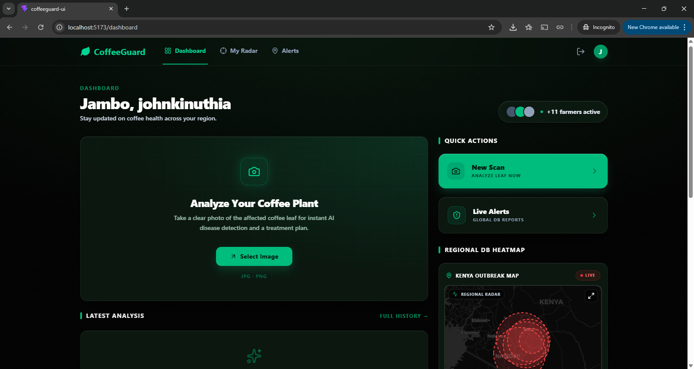
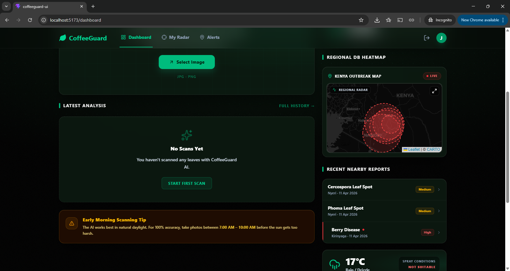
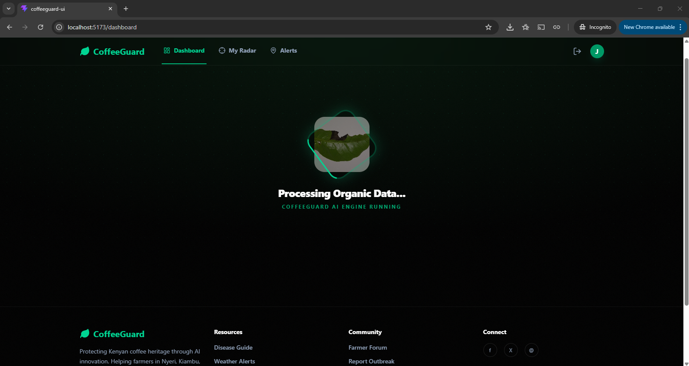
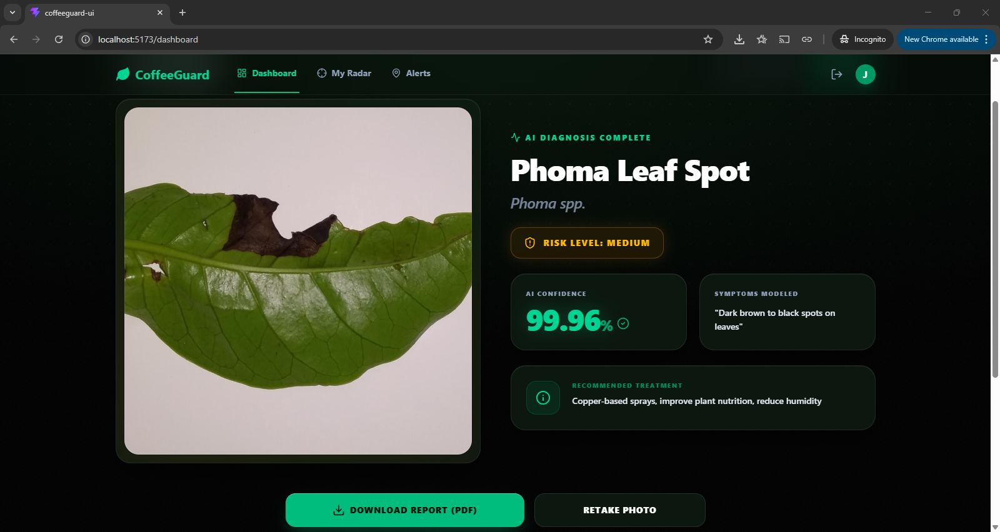
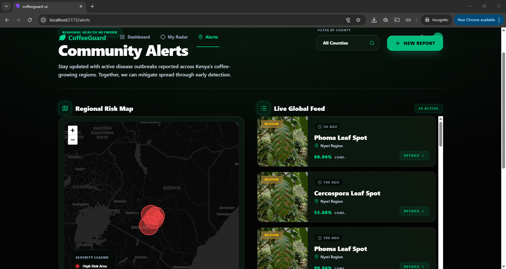
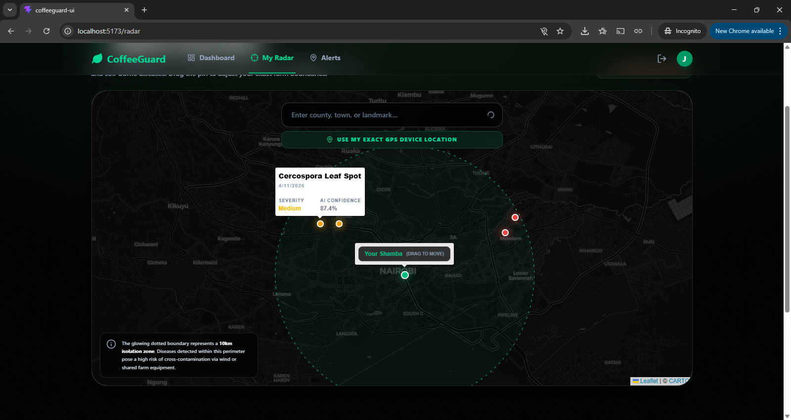
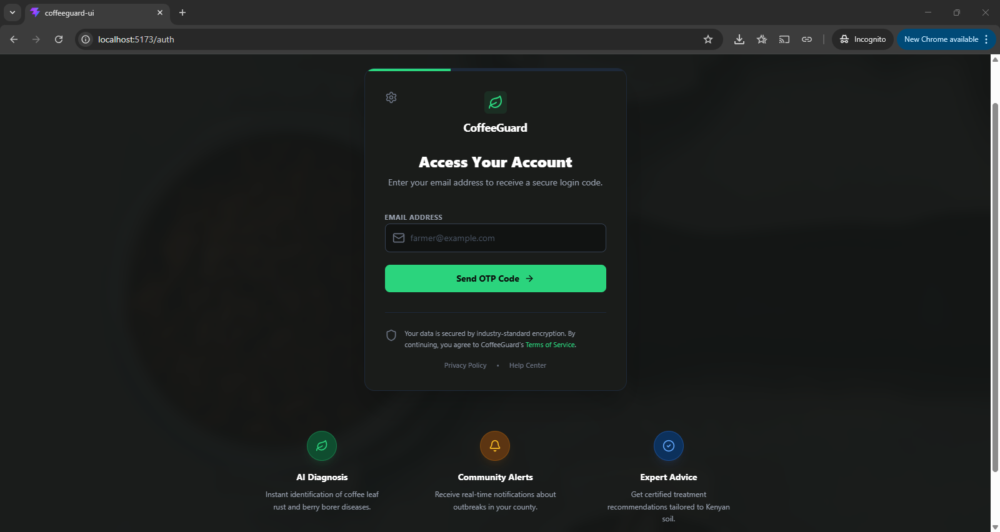
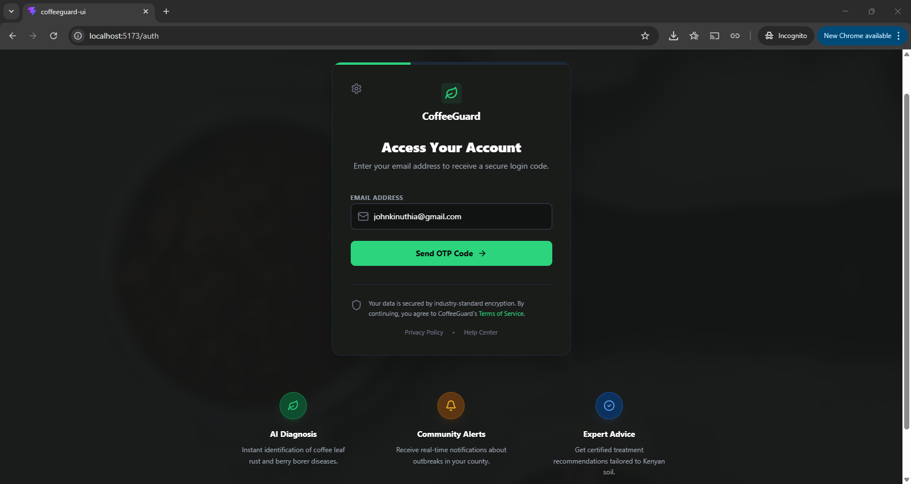
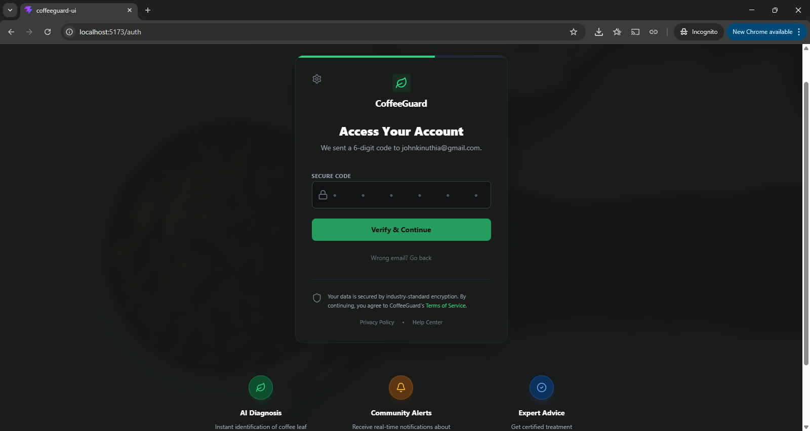

# ☕ CoffeeGuard

AI-powered full-stack agricultural monitoring platform integrating computer vision, geospatial analysis, and modern web technologies to support data-driven agricultural insights.

---

## 🚀 Overview

CoffeeGuard is a full-stack system designed to analyze and visualize agricultural data through AI-powered classification and geospatial mapping. The platform combines machine learning, backend microservices, and interactive frontend interfaces to deliver secure and scalable monitoring capabilities.

The system integrates a fine-tuned MobileNetV2 model with transfer learning and KNN-based classification to support intelligent analysis workflows.

---

## 🧩 Architecture

CoffeeGuard is structured as a modular full-stack system consisting of:

* A React frontend for visualization and interaction
* FastAPI backend services for API handling
* An AI inference microservice for model predictions
* Geospatial processing components for regional heatmap visualization

## ✨ Features

* 🤖 AI-powered image classification using MobileNetV2
* 🧠 Transfer learning and fine-tuning workflows
* 🔐 OTP-based authentication system
* ⚡ FastAPI microservices architecture
* 🗺️ Geospatial heatmap visualization
* 📍 Regional monitoring and mapping support
* 🎨 Responsive frontend built with React and Tailwind CSS
* 🔄 RESTful API communication
* 🐧 Linux-based deployment and development workflow

---

## 🛠️ Tech Stack

### Frontend

* React.js
* Tailwind CSS
* Axios

### Backend

* FastAPI
* Python
* REST APIs

### AI / Machine Learning

* MobileNetV2
* Transfer Learning
* KNN Classification

### Database & Geospatial Tools

* SQLite
* Spatialite
* GeoAlchemy

### Tools & Platforms

* Git & GitHub
* Linux
* Railway
* Vercel


---

## 📸 Screenshots

### Dashboard










### Heatmap Visualization






### Authentication Flow








---

## ⚙️ Installation

### Clone the repository

```bash
git clone https://github.com/WangariW/CoffeeGuard.git
cd CoffeeGuard
```

### Backend Setup(FastAPI)

Navigate to backend directory

```bash
cd backend
```
Install dependencies

```bash
pip install -r requirements.txt
```
Run FastAPI server

```bash
uvicorn api:app --reload
```
Backend runs on:

```bash
http://127.0.0.1:8000
```

### AI Service Setup

Navigate to AI service directory

```bash
cd ai-service
```

Activate virtual environment

```bash
source .venv/bin/activate
```

Install dependencies

```bash
pip install -r requirements.txt
```

Run AI inference service 

```bash
uvicorn api:app --reload
```


### Frontend Setup

Navigate to frontend directory

```bash
cd frontend
```

Install frontend dependencies 

```bash
npm install
```

Run development server
```bash
npm run dev
```

---
🔐 Configuration

Environment variables were used to securely manage API keys, authentication secrets, and service configuration during development and deployment.

---

## 🔮 Future Improvements

* Real-time monitoring updates
* Expanded AI model accuracy
* Cloud-native deployment
* Advanced analytics dashboard
* Mobile support

---

## 👩‍💻 Author

Erica Wangari Wangome
Software Engineering Student – USIU-Africa
